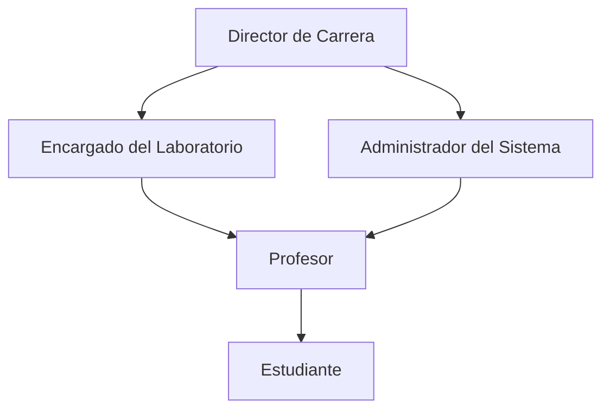
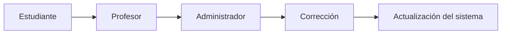

# Organización y Roles para la Gestión de Laboratorios de Computación

> Documento complementario al proyecto **"Plataforma Híbrida de Gestión de Laboratorios de Computación"**.

---

# 1. Introducción

La implementación de una plataforma híbrida para la gestión de laboratorios no depende únicamente de la infraestructura tecnológica, sino también de una adecuada organización de las personas involucradas en su operación.

La propuesta original describe la arquitectura técnica, los componentes de software y las metodologías ágiles que se utilizarán durante el desarrollo del proyecto. Sin embargo, para lograr una administración eficiente es necesario definir claramente los roles, responsabilidades y procesos que seguirán los diferentes actores del laboratorio.

Este documento complementa la propuesta inicial mediante una estructura organizacional que busca mejorar la coordinación entre estudiantes, docentes y personal administrativo, asegurando una gestión ordenada, segura y trazable de los recursos tecnológicos.

---

# 2. Objetivo

Definir una estructura organizacional para la administración de los laboratorios de computación que permita establecer responsabilidades claras, optimizar la gestión de recursos tecnológicos y fortalecer la colaboración entre los diferentes participantes del proyecto.

## Objetivos específicos

- Definir los principales roles dentro de la plataforma.
- Establecer responsabilidades para cada participante.
- Estandarizar los procesos de solicitud y administración de recursos.
- Mejorar la coordinación entre docentes, estudiantes y administradores.
- Facilitar la trazabilidad de las actividades realizadas dentro del laboratorio.

---

# 3. Organización propuesta

Se propone una organización basada en responsabilidades claramente definidas.

Esta estructura permite separar las responsabilidades administrativas, académicas y técnicas, facilitando una mejor coordinación entre todos los participantes.

---

# 4. Roles y responsabilidades

## 4.1 Director de Carrera

Es el responsable de supervisar el correcto funcionamiento del proyecto desde el punto de vista institucional.

### Responsabilidades

- Aprobar políticas relacionadas con los laboratorios.
- Autorizar inversiones en infraestructura.
- Supervisar el cumplimiento de los objetivos del proyecto.
- Coordinar mejoras académicas.
- Promover la actualización tecnológica.

---

## 4.2 Encargado del Laboratorio

Es el responsable de la administración de la infraestructura física.

### Responsabilidades

- Gestionar los laboratorios disponibles.
- Verificar el estado de los equipos.
- Coordinar el mantenimiento preventivo y correctivo.
- Administrar los horarios de uso.
- Reportar problemas de infraestructura.

---

## 4.3 Administrador del Sistema

Es el responsable técnico de toda la plataforma.

### Responsabilidades

- Administrar GitLab.
- Administrar Harbor.
- Gestionar usuarios y permisos.
- Crear imágenes Docker oficiales.
- Actualizar imágenes existentes.
- Implementar copias de seguridad.
- Aplicar actualizaciones de seguridad.
- Monitorear el estado de los servicios.
- Mantener la disponibilidad de la plataforma.

---

## 4.4 Profesor

Es el responsable de planificar las actividades académicas utilizando la plataforma.

### Responsabilidades

- Solicitar imágenes Docker necesarias para cada curso.
- Planificar prácticas de laboratorio.
- Validar las imágenes antes de ser utilizadas.
- Reportar incidencias.
- Coordinar con el encargado del laboratorio.

---

## 4.5 Estudiante

Es el usuario final del sistema.

### Responsabilidades

- Descargar únicamente imágenes autorizadas.
- Utilizar correctamente los recursos asignados.
- Reportar errores encontrados.
- Cumplir las normas de uso del laboratorio.
- Mantener buenas prácticas durante el desarrollo de las prácticas.

---

# 5. Procesos propuestos

## 5.1 Solicitud de una nueva imagen Docker

Cuando un docente necesita utilizar una nueva imagen para un curso se seguirá el siguiente proceso.

---

## 5.2 Reserva de laboratorio

---

## 5.3 Reporte de incidencias

---

# 6. Buenas prácticas de gestión

Para asegurar un funcionamiento eficiente del laboratorio se recomienda:

- Mantener todas las imágenes Docker correctamente versionadas.
- Realizar copias de seguridad periódicas.
- Documentar cada cambio realizado en la plataforma.
- Limitar los permisos de acuerdo con el rol de cada usuario.
- Implementar autenticación mediante Keycloak.
- Registrar todas las actividades importantes mediante auditorías.
- Mantener actualizado el software institucional.
- Eliminar imágenes obsoletas para evitar confusiones.

---

# 7. Indicadores de seguimiento

Para evaluar el funcionamiento de la plataforma se proponen los siguientes indicadores.

| Indicador | Objetivo |
|-----------|----------|
| Tiempo promedio para publicar una imagen | Menor a 24 horas |
| Disponibilidad del laboratorio | Mayor al 95 % |
| Número de incidencias resueltas | Mayor al 90 % |
| Actualización de imágenes | Cada semestre |
| Copias de seguridad exitosas | 100 % |

---

# 8. Recomendaciones

Como complemento de la propuesta original se recomienda:

- Definir responsables para cada proceso.
- Establecer procedimientos documentados para la administración del laboratorio.
- Capacitar periódicamente a docentes y estudiantes.
- Realizar auditorías semestrales.
- Actualizar las imágenes Docker antes del inicio de cada ciclo académico.
- Mantener un repositorio institucional con documentación técnica.
- Incorporar métricas que permitan evaluar el rendimiento de la plataforma.
- Elaborar un plan de contingencia para fallos del sistema.

---

# 9. Conclusiones

La propuesta presentada en este documento complementa la arquitectura técnica del proyecto mediante una organización claramente definida para la administración de los laboratorios.

La asignación de roles específicos permite distribuir adecuadamente las responsabilidades, reducir riesgos operativos y facilitar la comunicación entre docentes, estudiantes y administradores.

Asimismo, la incorporación de procesos estandarizados y buenas prácticas contribuye a mejorar la trazabilidad, la seguridad y la disponibilidad de los recursos tecnológicos, fortaleciendo la calidad del servicio ofrecido por la plataforma.

Finalmente, esta propuesta proporciona una base organizacional que puede adaptarse tanto al contexto universitario como al empresarial, alineándose con los objetivos generales del proyecto y favoreciendo su crecimiento futuro.